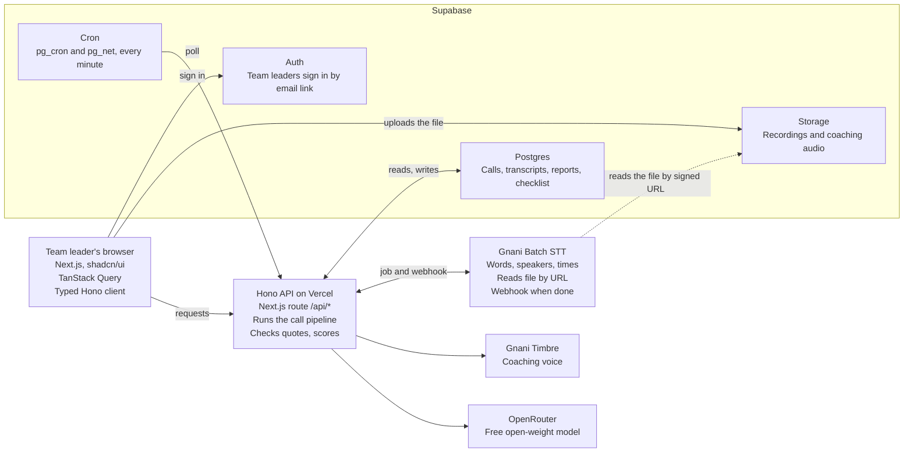

# SunoAI TRD

Last updated: 10 October 2026

## Summary

The SunoAI MVP is a Next.js app on Vercel, with a Hono API inside it and Supabase for data. It sends each call to Gnani's Batch speech-to-text, analyses the transcript with one free open-weight model on OpenRouter, and speaks coaching with Gnani Timbre.

The product is described in the [SunoAI Product Document](PRD.md). This document covers how it is built.

| Area | Decision |
| --- | --- |
| Frontend | Next.js (App Router), TanStack Query, shadcn/ui |
| Backend | Hono, mounted in a Next.js route handler and deployed on Vercel |
| Data | Supabase: Postgres, Auth, Storage and Cron |
| Speech to text | Gnani Prisma v2.5 through the Batch API, for timestamps and speaker labels |
| Coaching voice | Gnani Timbre v2.5 text-to-speech |
| Analysis | A free open-weight model on OpenRouter, called with the OpenRouter TypeScript SDK |
| Accounts | One team; everyone who signs in is a team leader |
| Live alerts | Not in the MVP; a design sketch is at the end |

## Scope

The MVP covers checking recorded calls end to end; anything live or multi-team comes later.

**In the MVP**

- Sign in for team leaders.
- Upload a call recording, pick up to 3 possible call languages and one coaching language.
- Transcription with timestamps and speaker labels, with optional noise removal.
- The full report: Needs review, red flags, score, frustration timeline, summary, checklist with quotes, transcript, AI fix notes and coaching text.
- Coaching audio, generated once per call and replayed from storage.
- Checklist editor: checks, red flags, and refund and compensation rules.
- Recent calls with the team's average score.
- Deleting a call and its files.

**Not in the MVP**

- Live alerts during a call.
- Several teams, roles or invitations.
- Sending coaching to agents.
- Trends over time.
- Gnani's Agent Builder API, which the challenge marks out of scope.

## Architecture

Hono on Vercel is the only part that talks to Gnani and the LLM. Keys stay on the server, and files go straight from the browser to Supabase Storage.

The browser talks only to Hono, plus Supabase for sign-in and uploads. Gnani reads each recording from Storage by signed URL and reports back through the webhook, and the cron job catches any webhook that never arrives.

## Call processing pipeline

A call moves through 5 statuses; no request waits on Gnani, because each step is triggered by the user, Gnani's webhook or a cron job.

1. **Create.** The page calls `POST /api/calls`. Hono creates a `calls` row and returns a signed upload URL for Supabase Storage.
2. **Upload.** The browser uploads the file straight to the private `calls` bucket. Files never pass through Vercel, which limits request bodies to about 4.5 MB.
3. **Start.** The page calls `POST /api/calls/:id/check`. Hono makes a signed download URL (valid 2 hours), creates a Gnani Batch job that reads the file from that URL, starts it, and saves the `job_id`.
4. **Wait.** Gnani calls `POST /api/webhooks/gnani` when the job ends. Because Gnani says webhooks are best-effort, a Supabase Cron job also calls `POST /api/jobs/poll` every minute for calls stuck in Transcribing or Analysing.
5. **Save the transcript.** Whichever arrives first downloads the transcript JSON from `transcript_url` (it expires after 1 hour) and saves every segment to `transcript_segments`.
6. **Analyse.** Hono sends the segments, the checklist and the refund rules to the LLM in one request, checks the answer in code (see LLM analysis), and saves the report.
7. **Show.** The page polls `GET /api/calls/:id` every 3 seconds while the call is not finished, then shows the report.
8. **Coach.** "Play coaching" calls `POST /api/calls/:id/coaching-audio`. The first time, Hono asks Gnani Timbre for the audio and stores it; after that it returns the stored file.

| Status | Meaning | Set by |
| --- | --- | --- |
| uploaded | File is in Storage; not checked yet | Create and upload |
| transcribing | Gnani job created and started | Start |
| analyzing | Transcript saved; LLM running | Webhook, cron or Check again |
| ready | Report saved | Analyse |
| failed | A step failed; `error` says which and why | Any step |

Each step moves the status forward only from the status it expects, with a conditional update (for example `update calls set status = 'analyzing' where id = $1 and status = 'transcribing'`). If the webhook and the cron job both arrive, only one of them does the work.

## Gnani integration

SunoAI uses two Gnani APIs: Batch speech-to-text for every call and Timbre text-to-speech for coaching. Gnani has no JavaScript SDK, so a small typed `fetch` wrapper (`lib/gnani.ts`) calls them from Hono. All calls go to `https://api.vachana.ai` with the key in the `X-API-Key-ID` header. Details are from the [Batch STT](https://docs.gnani.ai/api/STT/stt-batch), [create job](https://docs.gnani.ai/api/STT/batch/create-job) and [quick start](https://docs.gnani.ai/api/introduction/quick-start) pages, checked 9 October 2026.

**Batch speech-to-text**

We use Batch rather than the REST endpoint because REST returns only plain text, with no timestamps and no speakers. The report needs both.

| Step | Call |
| --- | --- |
| Create job | `POST /stt/v3/batch/jobs`, JSON body with `config`, `source` and `callback_url` |
| Start job | `POST /stt/v3/batch/jobs/{job_id}/start` |
| Check status | `GET /stt/v3/batch/jobs/{job_id}` |
| Get results | `GET /stt/v3/batch/jobs/{job_id}/files?status=COMPLETED`, then `GET` each `transcript_url` |
| Cancel | `POST /stt/v3/batch/jobs/{job_id}/cancel`, when a call is deleted mid-job |

| Setting | Value | Why |
| --- | --- | --- |
| `model` | `gnani-prisma-v2.5` | Current model |
| `language_code` | Up to 3 codes, comma-separated | Gnani picks one per file; the first is the fallback |
| `with_diarization` | `true` | Speaker labels |
| `num_speakers` | `3` | AI agent, human agent and customer (an upper limit) |
| `with_denoise` | A toggle on the upload screen, default on | Noisy phone audio; adds about a quarter of the call's length to processing |
| `is_multi_channel` | `false` | Turn on only for true stereo call recordings |
| `source` | `{"type":"cloud_storage","auth":{"mode":"public"},"paths":["<signed URL>"]}` | Gnani reads the file from Supabase, so there is no 10 MB upload limit |
| `callback_url` | `https://<app>/api/webhooks/gnani?token=<secret>` | Webhook for terminal job events |

The transcript gives `full_transcript`, `language_code`, `duration_seconds`, and `segments`, each with `segment_id`, `start_time`, `end_time`, `text` and `speaker_id`. Segments also have `sentiment` and `emotion` fields, but Gnani's examples leave them empty, so SunoAI doesn't use them. Batch returns numbers as spoken words (no number formatting), so order IDs and amounts can appear as words.

Job statuses `COMPLETED`, `PARTIAL_FAILURE`, `FAILED`, `START_FAILED` and `CANCELLED` are final. Polling must be no more often than every 10 seconds; our cron runs every minute.

**Timbre text-to-speech**

`POST /api/v1/tts/inference` with `text`, `voice`, `model` (`timbre-v2.5`), `language`, `speed` 0.9 and `audio_config` (mono, 16-bit, `linear_pcm`, `wav`). It returns WAV audio, which Hono saves to the private `coaching` bucket. Voices come from Gnani's [voice list](https://docs.gnani.ai/api/TTS/available-voices); Hinglish uses the language code `hi-en` and the voice Poorvi.

**Not used in the MVP**

- REST speech-to-text: no timestamps or speakers.
- Real-time WebSocket speech-to-text: for live alerts later.
- Streaming text-to-speech (SSE or WebSocket): coaching is short, so one request is enough.
- Voice cloning: would need the team leader's consent; a possible extra.
- Agent Builder Platform API: out of scope for the challenge.

## LLM analysis with OpenRouter

Each call gets exactly one LLM request that returns the whole report as JSON, because free models allow only 50 requests a day (1,000 a day after buying at least 10 credits, per the [OpenRouter FAQ](https://openrouter.ai/docs/faq)).

**Model**

The [Gnani and LLM spike](spikes/gnani-llm-spike.md) chose these free open-weight models on 10 October 2026. Every model in the list must accept a strict JSON schema, because the request sends one `response_format` to all of them.

| Order | Model | Context | Spike result |
| --- | --- | --- | --- |
| 1 | `nvidia/nemotron-3-super-120b-a12b:free` | 262K tokens | Matched the expected score 3 runs out of 3 in about 10 seconds |
| 2 | `dots-studio/dots-3-note-preview:free` | 512K tokens | Valid, but weaker: scores of 4/6 to 6/6, frustration rated too low, and an extra loop flag in 5 of 6 answers |

- Requests send a strict `json_schema` `response_format`, `reasoning: { enabled: false }` and `provider: { require_parameters: true }`, so only providers that honour the schema are picked. With reasoning on, Nemotron took up to 70 seconds and its score changed between runs.
- OpenRouter's `supported_parameters` is not enough to pick a model: `apodex/apodex-1.1-mini:free` lists `structured_outputs` but rejects `json_schema`, and both Gemma 4 free models offer only JSON mode. Try any new model through the spike before adding it.
- In the spike, Nemotron was unavailable for 1 of 3 requests sent with this list, so Dots answered. That answer took 26.5 seconds, against about 7 for Nemotron. The model that answered changes the report, which is why it is saved with each report.

- The model list lives in the `LLM_MODELS` environment variable and is sent as OpenRouter's `models` array, so OpenRouter falls back to the next model on errors or rate limits ([model fallbacks](https://openrouter.ai/docs/guides/routing/model-fallbacks)).
- Free models come and go, so the model that actually answered (the response's `model` field) is saved with each report.
- The client is `@openrouter/sdk` (ESM only), created once in `lib/llm.ts` with `OPENROUTER_API_KEY`. Its docs show `openRouter.chat.send({ model, messages })`; confirm the names for `models`, the JSON response format and `reasoning` in the SDK reference before building.

**What goes in**

- Every segment as one line: segment id, start time, speaker id and text.
- The checklist (check ids, names and rules), the red flags (ids, names and examples) and the refund and compensation rules.
- The coaching language.

**What comes back**

| Key | Holds |
| --- | --- |
| `speakers` | For each speaker id: `ai_agent`, `human_agent`, `customer` or `unknown`, plus a name if one was said |
| `customer_mood` | `calm`, `annoyed` or `angry` for each segment the customer speaks |
| `checks` | For each check id: `pass`, `miss` or `na`, a segment id, an exact quote and a reason |
| `red_flags` | Flag id, segment id, exact quote and a note |
| `summary` | 2 or 3 sentences in English |
| `fix_notes` | Segment id, title, what the AI said and what it should have done |
| `coaching` | Text in the coaching language plus English, or null when there is no human agent |

**Rules enforced in code, not trusted to the model**

1. The answer is parsed with Zod, with no retry: in the spike all 24 strict-schema answers were valid JSON. Every function that runs the analysis (the webhook, the cron job and Check again) sets a deadline 280 seconds after it starts, 20 seconds inside the 300-second function limit, and every outbound request it makes (the Gnani reads and the LLM request) is cancelled at that deadline. Invalid JSON or no answer by the deadline sets the call to `failed`, and Check again reruns only the analysis.
2. The model returns segment ids, never times. Code turns them into `start_time`, so no timestamp is invented.
3. Every quote must appear in its segment's text after normalising case, spaces and punctuation. A pass without a valid quote becomes a miss; a red flag without one is dropped and logged.
4. The score is passed checks divided by checks not marked `na`. 80% or more is Good, 50% to 79% Needs work, under 50% Poor.
5. `needs_review` is true when at least one red flag survives step 3.
6. Unknown check or flag ids are dropped.
7. The handover is the first segment from the speaker labelled `human_agent`, or null. The spike showed the model points a handover field at the AI's "connecting you" line.
8. Frustration is built from `customer_mood`, not asked of the model. Moods on segments not spoken by the `customer` speaker are dropped. A customer segment the model gives no mood keeps the previous one, or calm when there is none. Each mood holds from its segment until the customer's next segment, which gives the ranges. The peak is the highest level, and the turn is the first segment at the peak, or null when the peak is calm. The ranges and the turn are stored in `reports.frustration`, and the peak in `frustration_peak`.

The prompt also states the rules that changed the spike's results: a check passes when either agent does it; `human_not_transferred` applies even when a transfer comes later; a quote is the shortest phrase that proves the point, copied character for character and never transliterated; and only red flags that happened are listed.

The prompt lives in `lib/prompts/analyze.ts` with a `PROMPT_VERSION` constant, saved on each report with a snapshot of the checklist used. Editing the checklist later never changes old reports.

## Data model

Six Postgres tables and two private Storage buckets; each report's detailed results are stored as JSON on one row, because nothing queries across them yet.

| Table | Main columns | Notes |
| --- | --- | --- |
| `calls` | `id`, `title`, `file_path`, `file_size_bytes`, `mime_type`, `call_langs` (text[]), `coaching_lang`, `denoise`, `status`, `error`, `gnani_job_id`, `detected_lang`, `duration_seconds`, `created_by`, `created_at`, `checked_at`, `status_at` | `status` is a Postgres enum with the 5 pipeline statuses; `status_at` is when it last changed, so the cron job can find stuck calls |
| `transcript_segments` | `id`, `call_id`, `segment_id`, `start_time`, `end_time`, `speaker_id`, `text` | Deleted with its call |
| `reports` | `call_id`, `score_passed`, `score_total`, `needs_review`, `frustration_peak`, `frustration`, `speakers`, `handover_segment_id`, `checks`, `red_flags`, `fix_notes`, `summary`, `coaching`, `coaching_audio_path`, `llm_model`, `prompt_version`, `checklist_snapshot`, `created_at` | One row per call. Score, Needs review and peak are columns for the Recent calls list; the rest is JSON |
| `checklist_checks` | `id` (slug), `name`, `rule`, `position`, `active` | Seeded with the 6 default checks |
| `checklist_red_flags` | `id` (slug), `name`, `example`, `position`, `active` | Seeded with the 4 default red flags |
| `company_rules` | `id` (always 1), `text`, `updated_at` | Refund and compensation rules, one text block |

| Bucket | Path | Holds |
| --- | --- | --- |
| `calls` | `{call_id}/{file name}` | Uploaded recordings |
| `coaching` | `{call_id}.wav` | Generated coaching audio |

- Indexes: `calls (created_at desc)` for Recent calls, `calls (status)` for the cron job, and `transcript_segments (call_id, start_time)`.
- Removed checks and red flags are set to `active = false` rather than deleted, so old snapshots still read correctly.
- Schema changes are Supabase CLI migrations in `supabase/migrations`, and the default checklist is a seed file.

## API

Eleven Hono routes under `/api`: nine for the page, one for Gnani's webhook and one for the cron job.

| Route | Called by | What it does |
| --- | --- | --- |
| `POST /api/calls` | Page | Checks title, file name, size, type and languages; creates the call; returns its id and a signed upload URL |
| `POST /api/calls/:id/check` | Page | Confirms the file is in Storage, creates and starts the Gnani job, sets Transcribing |
| `POST /api/calls/:id/analyse` | Page | Check again: for a Failed call with a saved transcript, applies the daily guard, sets Analysing and reruns only the analysis |
| `GET /api/calls` | Page | Recent calls, newest first, with score, Needs review, peak frustration and status, plus the team average |
| `GET /api/calls/:id` | Page | The call, its report and its transcript segments |
| `POST /api/calls/:id/coaching-audio` | Page | Returns a signed URL for the coaching audio, generating it the first time |
| `DELETE /api/calls/:id` | Page | Cancels a running Gnani job, then deletes the files and rows |
| `GET /api/checklist` | Page | Active checks, red flags and rules |
| `PUT /api/checklist` | Page | Saves checks, red flags and rules in one transaction |
| `POST /api/webhooks/gnani` | Gnani | Checks the token, then finishes the call (save transcript, analyse) |
| `POST /api/jobs/poll` | Supabase Cron | Checks `CRON_SECRET` and sets calls in Analysing for over 5 minutes to Failed ("Analysis failed."), since their function was stopped. Then it asks Gnani about calls in Transcribing for over a minute, oldest first, and finishes the first one that is done; the rest wait for the next run |

- **Mounting:** `app/api/[[...route]]/route.ts` exports `GET`, `POST`, `PUT` and `DELETE` from `handle(app)` in `hono/vercel`. It runs on the Node.js runtime with `maxDuration` set to 300 seconds, the Hobby plan's maximum with Fluid compute, so the analysis step has time.
- **Validation:** Zod schemas with `@hono/zod-validator` on every body and parameter.
- **Auth:** middleware reads the Supabase session cookie with `@supabase/ssr` and returns 401 without one. The webhook and poll routes skip it and check their own secrets instead.
- **Typed client:** the app's route type is exported as `AppType`, and the frontend calls the API through `hc<AppType>('/api')` from `hono/client`, so requests and responses are typed end to end.
- **Errors:** every error is `{ "error": { "code", "message" } }` with a message a person can act on. Upstream error details are logged, never returned.
- **Webhook security:** Gnani's docs show no signature, so the callback URL carries a secret `token`, compared in constant time.

## Frontend

Five Next.js routes built from shadcn/ui parts, with all server data going through TanStack Query and the typed Hono client. The [SunoAI Prototype](https://claude.ai/artifact/MtyZJxoHXg5a61X6216nTk) is the visual reference.

| Route | Screen |
| --- | --- |
| `/login` | Sign in with an email link |
| `/` | Check a call: upload, call languages, coaching language, noise removal toggle, progress |
| `/calls` | Recent calls and the team average |
| `/calls/[id]` | The call report |
| `/checklist` | Checklist editor |

**shadcn/ui parts:** Button, Card, Badge, Select, Switch, Table, Input, Textarea, Alert (for Needs review), Progress, Skeleton, Tooltip, ScrollArea and Sonner for toasts.

**Custom components**

| Component | Does |
| --- | --- |
| `UploadDropzone` | File picker and drag-and-drop; checks type and size before upload |
| `CallStatus` | Shows Uploading, Transcribing, Analysing, Ready or Failed |
| `FrustrationTimeline` | Calm, annoyed and angry ranges across the call, with red flag and handover markers placed by time |
| `TranscriptView` | Agent, human and customer lines with times; a quote click scrolls to and highlights its line |
| `ChecklistResults`, `RedFlagsList`, `FixNotesList` | The report sections, each quote linked to its line |
| `CoachingPlayer` | Plays the coaching audio from its signed URL |

**TanStack Query**

| Query or mutation | Calls | Notes |
| --- | --- | --- |
| `['calls']` | `GET /api/calls` | Recent calls |
| `['call', id]` | `GET /api/calls/:id` | Refetches every 3 seconds while the status is not Ready or Failed, then stops |
| `['checklist']` | `GET /api/checklist` | |
| `useCheckCall` | `POST /api/calls`, upload to the signed URL, `POST /api/calls/:id/check` | Then opens `/calls/[id]` |
| `useCheckAgain` | `POST /api/calls/:id/analyse` | Invalidates `['call', id]`, which restarts its polling |
| `useCoachingAudio` | `POST /api/calls/:id/coaching-audio` | Cached per call |
| `useSaveChecklist` | `PUT /api/checklist` | Invalidates `['checklist']` |
| `useDeleteCall` | `DELETE /api/calls/:id` | Invalidates `['calls']` |

- The browser uses the Supabase client only to sign in and to upload to a signed URL (`uploadToSignedUrl`). Everything else goes through Hono.
- Light and dark themes use shadcn's CSS variables, plus SunoAI's own tokens for calm, annoyed and angry.
- Results always use words as well as colour (Passed, Missed, Angry), and the status line is announced to screen readers.

## Auth, security and privacy

Only invited team leaders can sign in, every table has row-level security, and API keys never reach the browser.

- **Sign-in:** Supabase Auth with email links. Public sign-ups are turned off, and team leaders are invited from the Supabase dashboard.
- **Row-level security:** on for every table. Because there is one team, the policy lets any signed-in user read and write everything.
- **Two Supabase clients in Hono:** page routes use the signed-in user's session, so row-level security applies. Only the webhook and cron routes use the service-role key.
- **Storage:** both buckets are private. Gnani gets a signed URL valid for 2 hours; the page gets coaching audio through a signed URL valid for 10 minutes.
- **Secrets:** Gnani, OpenRouter, the service-role key, the webhook token and the cron secret are server-only environment variables, never prefixed `NEXT_PUBLIC_`.
- **Logs:** job ids, statuses and timings only. No transcript text, quotes or audio URLs.
- **Test data:** synthetic calls made with Gnani Timbre where possible, otherwise our own acted recordings. The challenge rules allow no real customers, phone numbers, addresses, Aadhaar, PAN, payment details or real recorded calls.
- **Deleting:** deleting a call removes its recording, coaching audio, transcript and report.
- **OpenRouter:** prompts are not logged by default. Leave the account's data-training setting off; if a free model then becomes unavailable, use the fallback model.
- **Protecting the free limit:** `POST /api/calls/:id/check` and Check again (`POST /api/calls/:id/analyse`) read `free_model_daily_requests.remaining` from OpenRouter's `GET /api/v1/key` and refuse when no requests remain, since each uses exactly one. OpenRouter's counter follows whatever limit the account has and resets at midnight UTC (5:30 am IST). The spike showed failed requests don't count.

## Limits and error handling

The MVP accepts calls up to 50 MB and 30 minutes, and every failure ends in a clear message rather than a stuck spinner.

| Limit | Value | Where it comes from |
| --- | --- | --- |
| File size | 50 MB | Supabase Storage upload limit; Gnani reads by URL, so its 10 MB upload cap doesn't apply |
| Call length | 30 minutes | Gnani allows 4 hours, but its call analytics guide advises splitting calls over 30 minutes before LLM analysis |
| File types | WAV, MP3, MP4, FLAC, OGG, OPUS, M4A, AAC, WEBM, AMR | Gnani Batch |
| Polling | No more than every 10 seconds | Gnani; our cron runs every minute |
| Transcript link | Expires after 1 hour | Gnani; saved immediately |
| LLM requests | 50 a day without credits | OpenRouter free models |
| Request time | 300 seconds | Vercel Hobby maximum with Fluid compute; our `maxDuration` |

The browser reads the length from the file before upload and blocks files over 30 minutes; the server checks `duration_seconds` again after transcription.

| Failure | What the team leader sees | What the system does |
| --- | --- | --- |
| Upload fails | "Upload failed. Check your connection and try again." | Call stays Uploaded and can be retried |
| Gnani rejects the file | "Gnani couldn't read this file. Try an MP3 or WAV." | Status Failed with the reason |
| Gnani busy (429) or down (5xx) | Still Transcribing | The cron job retries, up to 5 times, then Failed |
| Job ends in `FAILED`, `START_FAILED` or `PARTIAL_FAILURE` | "Transcription failed." plus the reason | Status Failed |
| Empty transcript | "No speech found. Check the call language." | Status Failed |
| LLM returns bad JSON or no answer by the deadline | "Analysis failed." and a Check again button | Status Failed; Check again reuses the saved transcript and reruns only the analysis |
| Daily LLM limit reached | "Today's check limit is reached. Checking resumes at 5:30 am." | The check isn't started. If OpenRouter answers Analyse with a 429, Hono re-reads `free_model_daily_requests.remaining`: at 0 the call is Failed with this message, otherwise with "Analysis failed." |
| Coaching audio fails | "Couldn't create the coaching audio. Try again." | Nothing is saved; the next click retries |

## Testing

The rules that make the report trustworthy are tested in code; Gnani and the LLM are tested with 6 test calls.

| Level | Tool | What it covers |
| --- | --- | --- |
| Unit | Vitest | Score bands, quote matching, segment id to time, building frustration ranges from per-segment moods, the handover from speaker roles, the LLM output schema, parsing Gnani's transcript JSON |
| API | Vitest with Hono's `app.request()`, Gnani and OpenRouter mocked | Every route, status changes, the webhook and cron arriving together (only one finishes the call), the daily limit |
| End to end | Playwright, external services mocked | Sign in, upload, see the report, play coaching, edit the checklist, delete a call |
| Real services | A script run by hand | The 6 test calls through real Gnani and both LLMs, compared with their expected results |

- Expected results per test call are written down first: score, Needs review, red flags, peak frustration and the line where it turned.
- The analysis runs at temperature 0, and the same call is checked 3 times to confirm the score doesn't change.
- Test recordings stay in a private folder and are never committed; fixtures use made-up transcripts.

**Making the test calls.** We will try to make them fully synthetic with Gnani Timbre: each line spoken in its own voice (AI agent, human agent and customer) and joined into one audio file. For noisy telephonic audio, the synthetic call is played over a real phone call and re-recorded. If that isn't possible, we will record our own acted calls instead.

## Deployment and environment variables

One Vercel project serves the page and the API; one Supabase project holds the data, files and the cron job.

- **Vercel:** connected to the GitHub repository. Every branch gets a preview URL; `main` deploys to production.
- **Supabase:** migrations and the seed run with the Supabase CLI. A migration creates the two private buckets and turns on `pg_cron` and `pg_net`.
- **Cron:** a `pg_cron` job runs every minute and uses `pg_net` to call `https://<app>/api/jobs/poll` with the `x-cron-secret` header.
- **Local development:** Gnani can't reach `localhost`, so the webhook doesn't fire locally. Call `/api/jobs/poll` by hand, or open a tunnel to test the webhook.

| Variable | Available to | Used for |
| --- | --- | --- |
| `NEXT_PUBLIC_SUPABASE_URL` | Browser and server | The Supabase project |
| `NEXT_PUBLIC_SUPABASE_PUBLISHABLE_KEY` | Browser and server | Sign-in and signed uploads (the anon key on older projects) |
| `SUPABASE_SECRET_KEY` | Server | Webhook and cron routes (the service-role key on older projects) |
| `GNANI_API_KEY` | Server | Batch speech-to-text and Timbre |
| `GNANI_WEBHOOK_TOKEN` | Server | The secret in the callback URL |
| `OPENROUTER_API_KEY` | Server | The LLM |
| `LLM_MODELS` | Server | Model ids, first choice first, comma-separated |
| `CRON_SECRET` | Server and the Supabase cron job | Protects `/api/jobs/poll` |
| `APP_URL` | Server | Builds the webhook URL |

## Risks and things to confirm with Gnani

The biggest unknowns are how well Gnani separates an AI voice from a human one, and how good free models are at Hinglish.

| Risk | Effect | Plan |
| --- | --- | --- |
| Speaker separation with an AI voice, a human and a customer is untested | Wrong roles in the report | The LLM assigns roles, the page labels them a best guess, and the test calls check it |
| Free models change, disappear or handle Hinglish poorly | Analysis fails or is wrong | Fallback list in `LLM_MODELS`, the quote rule, Zod validation, and testing both models |
| A free model's upstream is busy | Nemotron was unavailable for 1 of 3 spike requests, so the weaker fallback wrote that report | Dots answers as the fallback, the report saves which model answered, and Check again reruns the analysis |
| 50 LLM requests a day | Testing or demo day hits the limit | One request per call and the daily guard. 10 OpenRouter credits are bought before demo day, which raises the limit to 1,000 a day |
| Gnani credits (5,000) and unpublished rate limits | Running out mid-testing | Short test calls, noise removal only when needed, and checking the dashboard |
| The webhook isn't signed | Someone could post fake results | Secret token, and the handler re-reads the job status from Gnani before trusting it |
| Vercel's 300-second limit (Hobby maximum) | A slow model or Gnani read keeps the function past it | One 280-second deadline per function covering every outbound request, no LLM retry, cron finishes one call per run and fails calls left in Analysing, and Check again reruns only the analysis |

**To confirm on Gnani's Discord**

- [ ] Does Batch support Gujarati and Punjabi? The docs say both yes and no.
- [ ] Does Batch support word boosting (`bias_list`)? The docs conflict.
- [ ] Will the `sentiment` and `emotion` segment fields be filled in?
- [ ] How many credits does a minute of Batch audio use, with and without noise removal?
- [ ] What are the rate limits for Batch jobs and Timbre?
- [ ] Can webhook calls be signed?

## Later: live alerts

Live alerts need a small long-running service beside the Vercel app, because Vercel functions can't hold a WebSocket open for a whole call. This is a sketch, not part of the MVP.

- **Gnani side:** real-time speech-to-text at `wss://api.vachana.ai/stt/v3/stream`, with `x-api-key-id`, `lang_code` and `x-sample-rate` headers. Audio is raw 16-bit mono PCM in 1,024-byte frames sent at real-time pace. A transcript arrives for each speech segment, and a session is capped at 15 minutes ([WebSocket docs](https://docs.gnani.ai/api/STT/stt-websocket)).
- **Live service:** Hono on Node, hosted on Railway, Render or Fly. It receives the call's audio stream, forwards it to Gnani, and holds the API key, since browsers can't send that header.
- **Checks:** each segment goes through fast phrase rules first (for example "insaan se baat" or "keeda"), with a short LLM check every few segments.
- **Alerts:** a new row in a `live_alerts` table reaches the team leader's screen through Supabase Realtime, and can suggest that the AI hand over.
- **Reliability:** follow Gnani's [real-time compliance guide](https://docs.gnani.ai/api/use-cases/real-time-compliance): up to 5 reconnects with backoff, segments de-duplicated by `segment_index`, and a new session before the 15-minute cap.
- **After the call:** the full recording still goes through the Batch pipeline for the complete report.
